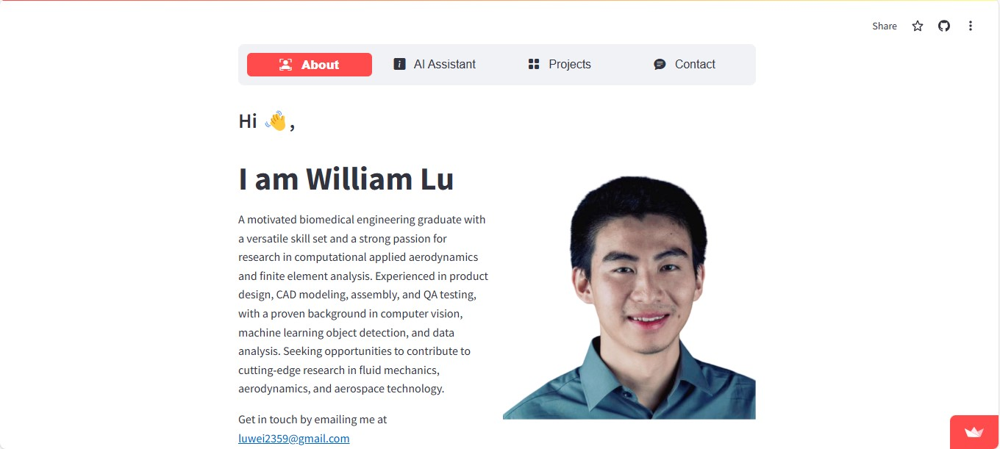
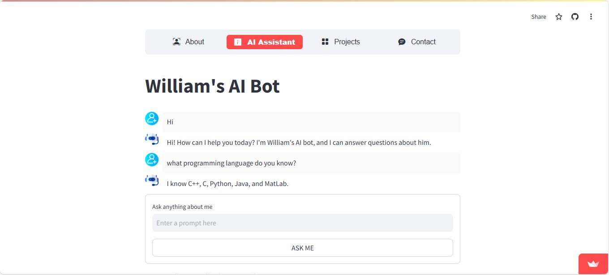

# AI Portfolio Website
Build your portfolio with Python, Streamlit, and Google AI. Showcase your coding skills to recruiters with a chatbot tailored to your resume.

## What it Does
This is personal portfolio website crafted with Python and Streamlit and with an interactive chatbot feature using Google AI. This site showcases my professional Experience, skills, projects, and educational background. The integrated chatbot serves as your guide, ready to answer questions about my experience and expertise.

### Home page

### AI bot

## What it Does
